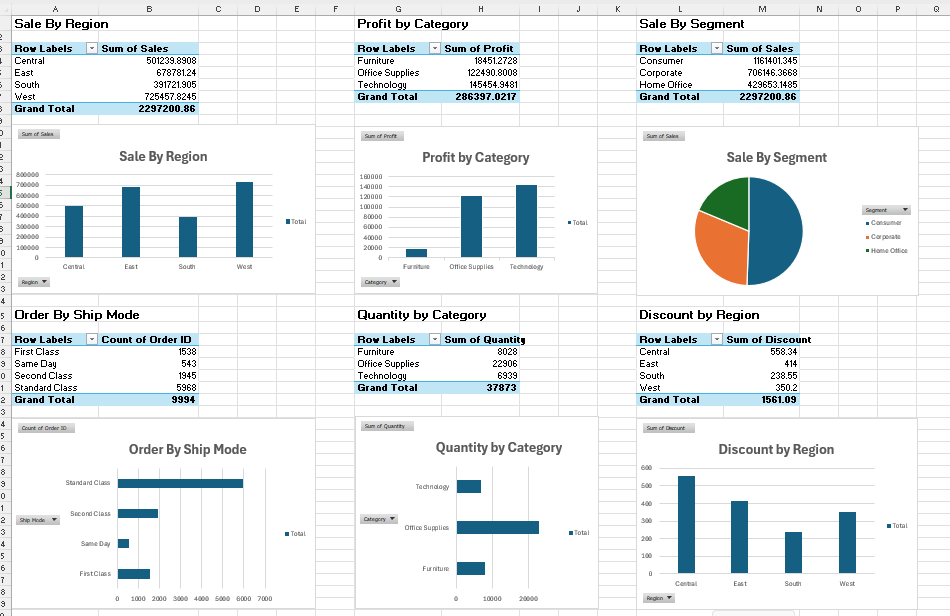

# 📊 Superstore Analytics Dashboard

## 🚀 Project Overview

The Superstore Analytics Dashboard project aims to analyze retail sales data and transform raw business information into meaningful insights using Excel, SQL, and Power BI.

This project focuses on identifying sales trends, profitability patterns, customer segments, and regional performance to support data-driven business decision-making.

---

## 🎯 Project Objectives

- Analyze overall sales and profit performance
- Identify high-performing regions and product categories
- Evaluate customer segment contributions
- Monitor discount distribution across regions
- Create interactive dashboards for business reporting

---

## 🛠️ Tools & Technologies

| Tool | Purpose |
|--------|----------|
| Microsoft Excel | Data Analysis & Dashboard Creation |
| SQL | Data Querying & Business Insights |
| Power BI | Interactive Data Visualization |


---

## 📈 Key Business Insights

✅ West Region generated the highest sales revenue.

✅ Technology Category produced the highest overall profit.

✅ Consumer Segment contributed the largest share of total sales.

✅ Sales performance varied significantly across regions and categories.

---

## 📊 Excel Dashboard



### Dashboard Highlights
- Sales by Region
- Profit by Category
- Sales by Segment
- Orders by Ship Mode
- Quantity by Category
- Discount by Region

---

## 📉 Power BI Dashboard


### Dashboard Features
- KPI Cards
- Sales Analysis by Region
- Profit Analysis by Category
- Segment-wise Sales Distribution
- Interactive Filters & Slicers
- Business Performance Monitoring

---

## 🗄️ SQL Analysis

The following SQL queries were used to extract business insights:

### 1️⃣ Total Sales Analysis

```sql
SELECT SUM(Sales) AS Total_Sales
FROM sales;
```

### 2️⃣ Regional Sales Analysis

```sql
SELECT Region,
SUM(Sales) AS Sales_By_Region
FROM sales
GROUP BY Region;
```

### 3️⃣ Category Profit Analysis

```sql
SELECT Category,
SUM(Profit) AS Total_Profit
FROM sales
GROUP BY Category;
```

---

## 📂 Project Files

- Superstore_Analytics_Dashboard.pbix
- Excel_Dashboard.png
- SQL Query Screenshots
- Power BI Dashboard Screenshot

---

## 💡 Business Value

This project helps organizations:

- Track sales performance effectively
- Identify profitable business areas
- Understand customer behavior
- Improve strategic decision-making
- Monitor key business metrics through dashboards

---

## 👩‍💻 Author

**Ananya Rawat**  
B.Tech CSE (Data Science & AI)

⭐ If you found this project useful, consider giving it a star!
