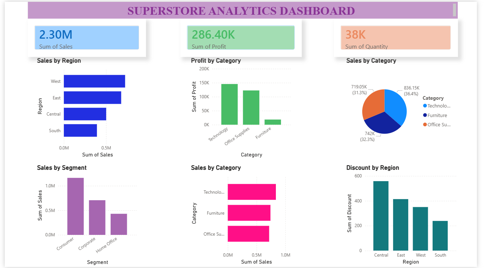

# Superstore Analytics Dashboard

##  Project Overview
This project focuses on analyzing Superstore sales data using Excel, SQL, and Power BI to generate business insights and create an interactive dashboard.

---

##  Tools Used
- Excel
- SQL
- Power BI

---

##  Dashboard Features
- KPI Cards for Sales, Profit, and Quantity
- Sales Analysis by Region
- Profit Analysis by Category
- Segment-wise Sales Analysis
- Discount Analysis by Region
- Interactive Visual Dashboard

---

##  Key Business Insights
- West region generated the highest sales.
- Technology category generated the highest profit.
- Consumer segment contributed maximum sales.

---

##  Dashboard Preview

---

##  SQL Queries Used

```sql
SELECT SUM(Sales) AS Total_Sales
FROM sales;

SELECT Region, SUM(Sales) AS Sales_By_Region
FROM sales
GROUP BY Region;

SELECT Category, SUM(Profit) AS Total_Profit
FROM sales
GROUP BY Category;
